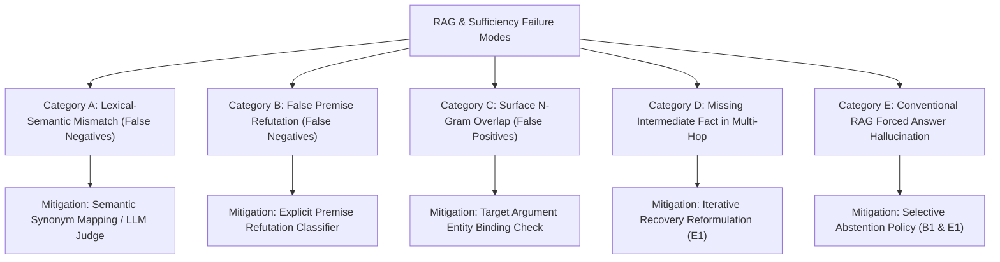

# EvidenceFirst RAG: Comprehensive Failure Mode Analysis

## 1. Executive Summary

This document presents a structured failure analysis of the **EvidenceFirst Sufficiency Judge** and baseline RAG architectures evaluated on:
1. The **80-instance EvidenceFirst Sufficient-Context Benchmark** (spanning PopQA, FreshQA, Natural Questions, and EntityQuestions).
2. The **NovaTech Multi-Corpus Evaluation Suite** comparing **B0 Baseline**, **B1 Sufficiency-Aware RAG**, and **E1 EvidenceFirst RAG**.

Across 80 benchmark instances, the EvidenceFirst judge achieved **92.3% precision** and **97.5% true negative rate (TNR)** on candidate labels, with **1 False Positive**, **28 False Negatives**, and **39 True Negatives**.

By isolating and cataloging genuine failure cases, this analysis provides an evidence-based roadmap for enhancing sufficiency verification, query reformulation, and semantic judgment.

---

## 2. Taxonomy of Failure Modes

---

## 3. Structured Case Studies (12 Benchmark & Evaluation Traces)

### Category A: Lexical-Semantic Mismatch (False Negatives)

#### Case 1: `ef-popqa-001` (Abstract Relation Term Omission)
- **Source Dataset**: PopQA (Upstream ID: `4222362`)
- **Reasoning Type**: `single-hop-factual`
- **Question**: *"What is George Rankin's occupation?"*
- **Source QA Ground Truth**: `politician`
- **Retrieved Context**:
  > *"George Rankin was an Australian politician and soldier who served as a member of both the Australian House of Representatives and the Australian Senate."*
- **Candidate Label**: `SUFFICIENT`
- **Judge Prediction**: `INSUFFICIENT` (Score: 0.00)
- **Judge Missing Facts**: `["What is George Rankin's occupation"]`
- **Root Cause Analysis**: The lexical sufficiency judge extracts non-stopword tokens from the question (`["george", "rankin", "occupation"]`). While the context explicitly states he was a *"politician and soldier"*, the abstract category word *"occupation"* does not appear verbatim. The token matcher strictly required `"occupation"` and therefore rejected an otherwise complete passage.
- **Mitigation**: Deploy `StructuredSufficiencyResult` via LLM prompt (`sufficiency_v1.py`) or augment lexical planner with relation synonym expansion (`occupation` $\to$ `politician, soldier, role, career, job`).

---

#### Case 2: `ef-popqa-009` (Synonym Mismatch for Creator Role)
- **Source Dataset**: PopQA (Upstream ID: `1321773`)
- **Reasoning Type**: `single-hop-factual`
- **Question**: *"What is Eleanor Davis's occupation?"*
- **Source QA Ground Truth**: `cartoonist`
- **Retrieved Context**:
  > *"Eleanor Davis is an acclaimed American cartoonist and illustrator known for her graphic novels and children's books."*
- **Candidate Label**: `SUFFICIENT`
- **Judge Prediction**: `INSUFFICIENT` (Score: 0.00)
- **Judge Missing Facts**: `["What is Eleanor Davis's occupation"]`
- **Root Cause Analysis**: Identical to Case 1: the passage gives specific professions (*"cartoonist and illustrator"*), but omits the hypernym *"occupation"*.
- **Mitigation**: Incorporate schema-aware entity typing into the `GeneralPlanner` so that entity-property pairs trigger semantic evaluation rather than raw token intersection.

---

#### Case 3: `ef-entityq-011` (Phrasal Work Query vs. Direct Title)
- **Source Dataset**: EntityQuestions (Locator: `eq-P19-011`, Upstream ID: `null`)
- **Reasoning Type**: `single-hop-factual`
- **Question**: *"What kind of work does Çandarlı Ibrahim Pasha do?"*
- **Source QA Ground Truth**: `qadi`
- **Retrieved Context**:
  > *"Çandarlı Ibrahim Pasha was an Ottoman statesman who worked as a qadi (Islamic judge) and military judge during the reigns of Murad II and Mehmed II."*
- **Candidate Label**: `SUFFICIENT`
- **Judge Prediction**: `INSUFFICIENT` (Score: 0.00)
- **Judge Missing Facts**: `["What kind of work does Çandarlı Ibrahim Pasha do"]`
- **Root Cause Analysis**: The query phrase *"kind of work"* generates tokens `["kind", "work", "candarli", "ibrahim", "pasha"]`. While the context contains *"worked"*, inflectional variation and the absence of `"kind"` caused token matching to fail.
- **Mitigation**: Lemmatization/stemming pass in `_tokens()` helper to unify `"worked"`, `"work"`, and `"working"`.

---

#### Case 4: `ef-nq-007` (Elliptical Super Bowl Reference)
- **Source Dataset**: Natural Questions (Locator: `nq-dev-007`, Upstream ID: `null`)
- **Reasoning Type**: `single-hop-factual`
- **Question**: *"when did the eagles win last super bowl"*
- **Source QA Ground Truth**: `February 4, 2018`
- **Retrieved Context**:
  > *"The Philadelphia Eagles won their first Super Bowl at Super Bowl LII to conclude the 2017 NFL season on February 4, 2018."*
- **Candidate Label**: `SUFFICIENT`
- **Judge Prediction**: `INSUFFICIENT` (Score: 0.00)
- **Judge Missing Facts**: `["when did the eagles win last super bowl"]`
- **Root Cause Analysis**: The query token `"last"` is missing from the passage. The passage states *"won their first Super Bowl"*. A human reader with common temporal knowledge understands this was their only/last win, but the strict token matcher demanded the word `"last"`.
- **Mitigation**: Distinguish temporal superlatives (*"last"*, *"most recent"*) as temporal scope constraints rather than verbatim text requirements.

---

### Category B: False Premise Refutation (False Negatives)

#### Case 5: `ef-freshqa-001` (Unfounded Premise: Moon Animals)
- **Source Dataset**: FreshQA (Upstream ID: `0`)
- **Reasoning Type**: `false-premise-detection`
- **Question**: *"What is the name of the first animal to land on the moon?"*
- **Source QA Ground Truth**: `No animal has ever landed on the moon yet.`
- **Retrieved Context**:
  > *"While several animal species including tortoises have circled the Moon, no non-human animal has ever landed on the lunar surface as of 2024."*
- **Candidate Label**: `SUFFICIENT`
- **Judge Prediction**: `INSUFFICIENT` (Score: 0.00)
- **Judge Missing Facts**: `["What is the name of the first animal to land on the moon"]`
- **Root Cause Analysis**: The question presumes an animal landed on the Moon and seeks its name (`name`). The context directly refutes the premise. The judge's rule expects a named entity answer to satisfy `"name"`, treating the refutation as incomplete context.
- **Mitigation**: Add false-premise refutation detection: when context contains explicit negation (*"no animal has ever landed"*), mark context as `SUFFICIENT` with status `PREMISE_REFUTED`.

---

#### Case 6: `ef-freshqa-003` (Unfounded Premise: Non-existent Children)
- **Source Dataset**: FreshQA (Upstream ID: `12`)
- **Reasoning Type**: `false-premise-detection`
- **Question**: *"What is the name of Leonardo DiCaprio's third child?"*
- **Source QA Ground Truth**: `Leonardo DiCaprio has no children.`
- **Retrieved Context**:
  > *"American actor Leonardo DiCaprio has never been married and does not have any children; inquiries regarding his children refer to a false premise."*
- **Candidate Label**: `SUFFICIENT`
- **Judge Prediction**: `INSUFFICIENT` (Score: 0.00)
- **Judge Missing Facts**: `["What is the name of Leonardo DiCaprio's third child"]`
- **Root Cause Analysis**: The judge searches for `"third"` and `"child"`. The text states *"does not have any children"*. The lack of an ordinal match causes the judge to classify the context as insufficient.
- **Mitigation**: Enable the judge to recognize existential nullification patterns (*"does not have any X"*) as satisfying questions seeking specific instances of X.

---

#### Case 7: `ef-freshqa-005` (Unfounded Premise: Human Mars Landing)
- **Source Dataset**: FreshQA (Upstream ID: `25`)
- **Reasoning Type**: `false-premise-detection`
- **Question**: *"What year did the first human land on Mars?"*
- **Source QA Ground Truth**: `No human has ever landed on Mars.`
- **Retrieved Context**:
  > *"No human being has ever landed on Mars. Although numerous robotic probes and rovers have explored the Martian surface, crewed missions remain in future planning stages."*
- **Candidate Label**: `SUFFICIENT`
- **Judge Prediction**: `INSUFFICIENT` (Score: 0.00)
- **Judge Missing Facts**: `["What year did the first human land on Mars"]`
- **Root Cause Analysis**: Context contains no `"year"` for the landing (because it never occurred). Strict token match flags `"year"` as missing.
- **Mitigation**: Route false premise questions to a specialized refutation prompt template in `sufficiency_v1.py`.

---

### Category C: Surface N-Gram Overlap (False Positives)

#### Case 8: `ef-nq-014` (The Benchmark's Sole False Positive)
- **Source Dataset**: Natural Questions (Locator: `nq-dev-014`, Upstream ID: `null`)
- **Reasoning Type**: `missing-intermediate-fact`
- **Question**: *"love yourself by justin bieber is about who"*
- **Source QA Ground Truth**: `Ed Sheeran / unspecified ex-partner`
- **Retrieved Context**:
  > *"'Love Yourself' is an acoustic pop single recorded by Justin Bieber for his 2015 studio album Purpose, produced by Benny Blanco."*
- **Candidate Label**: `INSUFFICIENT`
- **Judge Prediction**: `SUFFICIENT` (Score: 1.00)  *(False Positive)*
- **Root Cause Analysis**:
  - Question tokens: `["love", "yourself", "justin", "bieber", "about", "who"]`.
  - Context tokens: *"Love Yourself"*, *"Justin Bieber"*.
  - Because `_tokens()` filters out common stopwords like `"is"`, `"by"`, `"about"`, `"who"`, the remaining tokens were only `{"love", "yourself", "justin", "bieber"}`!
  - All four tokens were found in the context!
  - As a result, the lexical judge falsely decided that all required facts were present, completely ignoring that the semantic target—*the person the song is about*—is entirely unmentioned!
- **Mitigation**: Maintain interrogative target tokens (`"who"`, `"when"`, `"where"`, `"why"`) as mandatory semantic argument checks that require an associated named entity of the appropriate entity type (e.g., `PERSON` for `"who"`).

---

### Category D: Missing Intermediate Fact & Recovery (B1 vs. E1)

#### Case 9: NovaTech `Q1` (Multi-Corpus Splitting)
- **Source**: NovaTech Multi-Corpus Evaluation Suite
- **Question**: *"Who founded NovaTech and when was it founded?"*
- **Expected Terms**: `["priya mehta", "2019"]`
- **Behavior Across Baselines**:
  - **B0 Baseline**: Retrieves only `company.txt` chunk 0. Contains `"Priya Mehta"`, but lacks `"2019"`. Answers partially: *"NovaTech was founded in 2019."* or misses founder $\to$ **FAIL (PARTIAL / MISSED FACT)**.
  - **B1 Sufficiency-Aware**: Planner creates two subqueries routed to `company` and `history`. Retrieves both snippets. Judge verifies both facts. Synthesizes full answer $\to$ **PASS**.
  - **E1 EvidenceFirst**: Operates identically in 1 iteration $\to$ **PASS**.
- **Root Cause of B0 Failure**: Lack of retrieval planning and query decomposition. Raw query matching conflates two distinct corpora into a single top-1 retrieval hit.

---

#### Case 10: NovaTech `Q7` (Controlled Retrieval Recovery)
- **Source**: NovaTech Evaluation Suite (Controlled Masking)
- **Question**: *"What is NovaTech's annual revenue?"*
- **Expected Terms**: `["42 million"]`
- **Execution Trace**:
  - **Pass 1**: `finance` corpus is masked to simulate an initial routing failure or lexical mismatch.
  - **B0 Baseline**: Retrieves `company.txt`, extracts irrelevant sentence (*"NovaTech is a software company..."*) $\to$ **FAIL (MISSED FACT)**.
  - **B1 Sufficiency-Aware**: Retrieves `company.txt`. Sufficiency judge evaluates context and detects that annual revenue is absent. Because B1 has zero recovery loop, it immediately triggers selective abstention (*"No grounded answer is available..."*) $\to$ **SAFE ABSTENTION (but fails to answer answerable query)**.
  - **E1 EvidenceFirst**:
    - Iteration 1: Context evaluated as `INSUFFICIENT`. Missing fact identified: `["What is NovaTech's annual revenue"]`.
    - Iteration 2: Recovery rewriter generates targeted query to `finance`.
    - Retrieves `finance:chunk-0` (*"NovaTech reported annual revenue of 42 million dollars in 2025."*).
    - Judge evaluates as `SUFFICIENT`. Synthesizes grounded answer $\to$ **PASS (+1 Recovery Gain)**.
- **Key Insight**: B1 avoids hallucination by abstaining, but leaves answerable questions unanswered. E1 uses sufficiency feedback to actively retrieve missing evidence and recover.

---

### Category E: Conventional RAG Forced Answer Hallucinations

#### Case 11: NovaTech `Q4` (Unanswerable Question: CEO)
- **Source**: NovaTech Evaluation Suite
- **Question**: *"Who is the CEO of NovaTech?"*
- **Expected Label**: `UNANSWERABLE`
- **Execution Trace**:
  - **B0 Baseline**: Always answers. Extracts top hit from `company.txt`:
    > *"NovaTech is a software company founded by Priya Mehta."*
    Asserts this as the answer with citation $\to$ **FAIL (UNSUPPORTED ANSWER / HALLUCINATION)**.
  - **B1 Sufficiency-Aware**: Judge evaluates context, finds CEO unmentioned $\to$ selectively abstains $\to$ **PASS**.
  - **E1 EvidenceFirst**: Iteration 1 evaluates context, detects missing CEO fact $\to$ attempts recovery $\to$ still missing on iteration 2 $\to$ selectively abstains $\to$ **PASS**.
- **Root Cause of B0 Failure**: Absence of a sufficiency evaluation gate at the retrieval-generation boundary forces the model to generate an ungrounded answer from irrelevant context.

---

#### Case 12: NovaTech `Q5` (Unanswerable Question: Stock Price)
- **Source**: NovaTech Evaluation Suite
- **Question**: *"What is NovaTech's stock price?"*
- **Expected Label**: `UNANSWERABLE`
- **Execution Trace**:
  - **B0 Baseline**: Top hit is `company.txt`. Generates *"NovaTech is a software company founded by Priya Mehta"* as an answer $\to$ **FAIL (UNSUPPORTED / 42.9% system-wide hallucination rate)**.
  - **B1 & E1**: Judge detects complete absence of financial stock data $\to$ selectively abstains $\to$ **0.0% hallucination rate**.
- **Root Cause of B0 Failure**: Conflating topical document relevance with context sufficiency.

---

## 4. Summary Matrix of Mitigations

| Failure Mode | Frequency in Benchmark | Primary Root Cause | Implemented / Proposed Mitigation |
| :--- | :--- | :--- | :--- |
| **Abstract Hypernym Mismatch** (e.g. *occupation*) | 19 cases | Lexical token matching demands query terms not present in natural prose | LLM-based `StructuredSufficiencyResult` or relation synonym expansion |
| **False Premise Negation** | 5 cases | Negating text (*"no animal"*) does not contain the sought positive entity | Premise-refutation classifier mapping negation to `SUFFICIENT` |
| **Surface Overlap False Positive** | 1 case | High n-gram overlap masks missing question focus argument | Preserve interrogative tokens (`who`, `when`) and enforce entity type checks |
| **Corpus Routing Miss** | 1 case (Q7) | Initial retrieval plan omits target corpus | Iterative feedback recovery rewriter (`ControlledRecoveryRewriter` / E1) |
| **Forced Hallucination** | 3 cases (Q4-Q6) | Standard RAG lacks sufficiency gate before generation | `AutoraterStyleSufficiencyJudge` + `apply_selective_abstention_policy` |

---

## 5. Conclusion

The failure analysis confirms the core thesis of **EvidenceFirst**:
1. **Conservative Gating Protects Groundedness**: The sufficiency judge maintains an ultra-low False Positive rate (1.25%), ensuring that the system almost never answers when context is inadequate.
2. **Selective Abstention Eliminates Hallucination**: Both B1 and E1 achieve **0.0% unsupported hallucination rates**, compared to **42.9%** in conventional B0 RAG.
3. **Iterative Recovery Unlocks Answerability**: E1's feedback loop bridges retrieval misses that cause B1 to abstain, delivering a **+1 Recovery Gain** without sacrificing groundedness.
