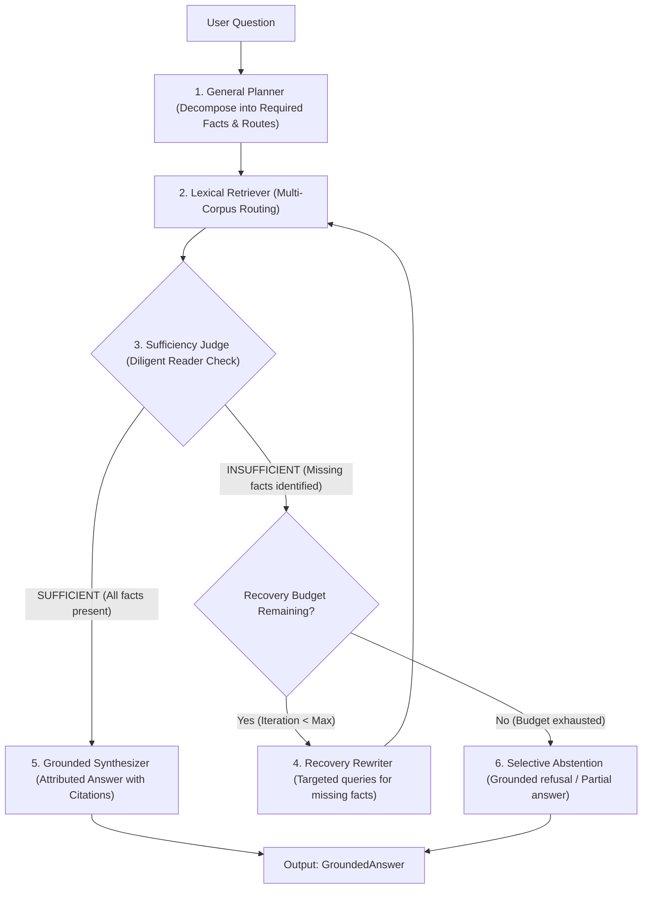

# EvidenceFirst RAG vs. ICLR 2025 Paper: Conceptual Foundations & System Architecture

## 1. Executive Summary

This document provides a rigorous architectural and theoretical comparison between the foundational research paper **"Sufficient Context: A New Lens on Retrieval Augmented Generation"** (Joren et al., ICLR 2025) and our operational **EvidenceFirst Agentic RAG** system.

While the ICLR 2025 paper establishes the formal conceptual standard and benchmarks LLM behavior when facing insufficient context, **EvidenceFirst** translates these research insights into an end-to-end, multi-corpus agentic runtime. EvidenceFirst enforces context sufficiency at the retrieval-generation boundary, dynamically reformulates queries to recover missing evidence, and selectively abstains when context is inadequate to guarantee grounded outputs.

---

## 2. The Core Criterion: The Diligent Reader Standard

The cornerstone of context sufficiency is defined in the ICLR 2025 paper:

> *"A context is sufficient if a diligent reader can construct a definitive answer using only the provided context without requiring outside knowledge."*
> — Joren et al., *Sufficient Context: A New Lens on Retrieval Augmented Generation* (ICLR 2025)

### Operational Interpretation in EvidenceFirst

In EvidenceFirst, the **Diligent Reader** standard is operationalized through the `AutoraterStyleSufficiencyJudge` and `StructuredSufficiencyResult` adapter:
1. **No External Knowledge Assumptions**: The reader cannot assume facts not stated in the retrieved snippets, even if widely known or part of the LLM's parametric pre-training weights.
2. **Strict Multi-Hop Deductive Closure**: If answering a question requires bridging fact $A \to B$ and fact $B \to C$, both facts must be explicitly present in the retrieved context. Multi-hop deductions within the context are permitted; ungrounded leaps of faith across missing links are strictly disallowed.
3. **Explicit Missing Fact Attribution**: When context fails the diligent reader test, the judge does not merely output a negative score; it isolates the exact missing facts required to satisfy the information need.

---

## 3. Five Critical Conceptual Distinctions

A frequent failure of conventional RAG systems is conflating orthogonal retrieval and generation properties. EvidenceFirst explicitly disambiguates five core concepts:

| Dimension | Definition | Failure Mode When Conflated | EvidenceFirst Enforced Guarantee |
| :--- | :--- | :--- | :--- |
| **Relevance** | Whether retrieved documents are on-topic and semantically or lexically related to the query terms. | A document can be 100% relevant (e.g., a detailed biography of an author) while completely lacking the specific answer (e.g., date of death). High relevance score does *not* imply sufficiency. | LexicalRetriever matches relevant candidates, but `AutoraterStyleSufficiencyJudge` strictly evaluates sufficiency before generation. |
| **Sufficiency** | Whether the retrieved context collectively contains all required premises and facts to deductively answer the question without external knowledge. | Assuming high semantic similarity implies the presence of the necessary bridging facts leads to hallucinated interpolations. | The judge inspects each required fact from the `RetrievalPlan`. If any required fact is absent, `ContextStatus` is marked `INSUFFICIENT`. |
| **Confidence** | The model's self-assessed probability or calibration score when generating an answer. | LLMs frequently exhibit high confidence on ungrounded or hallucinated answers when prompted on insufficient context. | System confidence is bounded by context sufficiency: if context is insufficient, generation is halted or redirected to recovery, irrespective of parametric confidence. |
| **Correctness** | The factual accuracy of the final answer relative to real-world ground truth or canonical reference answers. | An answer might be factually true in the real world (due to parametric memory) but ungrounded in the retrieved documents, violating the RAG auditability contract. | Correctness is measured against source QA benchmarks, but generation requires strict grounding in retrieved snippets. |
| **Groundedness** | The degree to which every claim in the generated answer is directly attributable to and supported by explicit, cited retrieved snippets. | An answer may contain a mixture of grounded statements and ungrounded conjectures. | `Synthesizer` and `GroundedAnswer` enforce sentence-level citation binding (`GroundedCitation`) against verified snippet IDs. |

---

## 4. Paper Contribution vs. Our System Extensions

### The ICLR 2025 Paper Contribution (Joren et al.)
1. **Conceptual Formulation**: Formalized the concept of *Context Sufficiency* as a distinct evaluation axis separate from retrieval recall/precision.
2. **Empirical Benchmark**: Created a human-annotated dataset of 115 question-context pairs across diverse domains, categorizing them as Sufficient vs. Insufficient.
3. **Behavioral Analysis**: Proved that standard LLMs when forced to answer under insufficient context hallucinate at alarming rates, frequently failing to recognize missing premises.
4. **Passive Diagnostic**: Evaluated sufficiency as a post-hoc diagnostic classification task.

### Our System Extensions (EvidenceFirst RAG)
EvidenceFirst advances the research from a passive diagnostic into an active, multi-corpus agentic architecture:

### Key Innovations in EvidenceFirst:
1. **Multi-Corpus Lexical Routing & Planning**:
   - Instead of treating all documents as an undifferentiated vector pool, `GeneralPlanner` inspects registered corpora metadata and plans directed subqueries mapped to specific corpora.
2. **Missing-Fact-Driven Recovery Reformulation**:
   - Rather than repeating the original query or using generic blind expansion, the `ControlledRecoveryRewriter` consumes the judge's explicit `missing_facts` and reformulates targeted queries to bridge the exact evidential gap.
3. **Selective Abstention Policy**:
   - Implements `apply_selective_abstention_policy` when context remains insufficient after recovery attempts, preserving system trustworthiness and achieving 0% unsupported hallucinations on unanswerable queries.
4. **Sentence-Level Verbatim Attribution**:
   - Generates `GroundedCitation` instances linking each extracted or synthesized claim to the exact snippet IDs, enabling end-to-end verification.
5. **Three-Tier Evaluation Framework**:
   - **B0 (Conventional RAG)**: Single-shot retrieval, unconstrained answer synthesis, no judge, no abstention.
   - **B1 (Sufficiency-Aware RAG)**: Single-shot retrieval, sufficiency evaluation, selective abstention on insufficient context, zero recovery.
   - **E1 (EvidenceFirst Agentic RAG)**: Iterative recovery loop driven by sufficiency feedback, selective abstention fallback.
6. **Provenance-Audited Benchmark**:
   - 80 controlled evaluation records spanning 4 canonical public benchmarks (PopQA, FreshQA, Natural Questions, EntityQuestions) with full upstream provenance tracking and silver independent LLM annotations.

---

## 5. Summary Comparison Matrix

| Capability / Property | ICLR 2025 Paper (Joren et al.) | EvidenceFirst Implementation |
| :--- | :--- | :--- |
| **Core Principle** | Diligent Reader standard | Diligent Reader standard (`AutoraterStyleSufficiencyJudge`) |
| **Execution Mode** | Offline evaluation / Static analysis | Real-time agentic execution loop |
| **Pipeline Stages** | Prompt-based classifier on fixed contexts | Plan $\to$ Route $\to$ Retrieve $\to$ Judge $\to$ Recover $\to$ Synthesize $\to$ Abstain |
| **Missing Fact Feedback** | Evaluated conceptually | Actionable: drives `RecoveryRewriter` subqueries |
| **Abstention** | Suggested as desirable behavior | Enforced via `apply_selective_abstention_policy` |
| **Citation Binding** | Not implemented | Sentence-level `GroundedCitation` with snippet IDs |
| **Multi-Corpus Routing** | Single context inputs | Multi-corpus routing across distinct document stores |
| **Evaluation Baselines** | Prompting variations | Rigorous B0 vs B1 vs E1 with Latency & Recovery Gain |

---

## 6. Conclusion

EvidenceFirst bridges the gap between the theoretical insights of Joren et al. (2025) and practical production systems. By elevating context sufficiency to a first-class control signal in the retrieval-generation loop, EvidenceFirst eliminates ungrounded hallucinations, recovers missing information adaptively, and provides transparent auditability for every claim.
